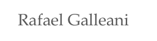
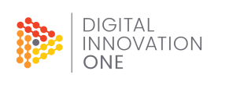

[@rafaelgalleani](https://www.youtube.com/c/RafaelGalleani)            |  [@digitalinnovationone](https://digitalinnovation.one/)
:-------------------------:|:-------------------------:
  |  

# Python Fudamentos

### Curso Fundamentos em Python ministrados na plataforma [DIO](https://digitalinnovation.one/)

Foram ministrados doze aulas abordando temas fundamentais da linguagem Python. 
Todo o conteúdo prático se encontra nos módulos Python deste projeto.
No diretório slides está todo conteúdo teórico das aulas.

As aulas são gratuítas e podem ser acessadas diretamente na plataforma da [Digital Innovation One (DIO)](https://digitalinnovation.one/).

**Conteúdo por aula:**

1. Linguagem Python e configuração de ambiente
2. Variáveis, operações aritméticas, strings, conversão e input de usuário
3. Condicionais
4. Laços de repetição
5. Listas e Tuplas
6. Conjuntos (sets)
7. Funções, métodos e classes
8. Importação de módulos e funções anônimas (lambda)
9. Manipulação de arquivos
10. Manipulação de datas
11. Tratamentos de exceções
12. Instalação de pacotes e requisições web